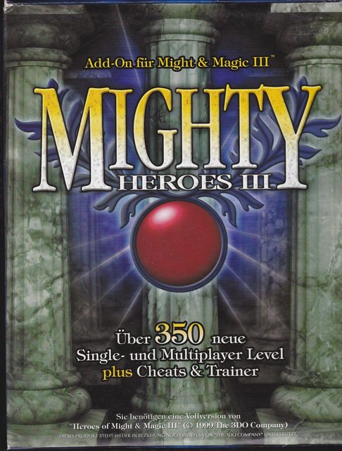
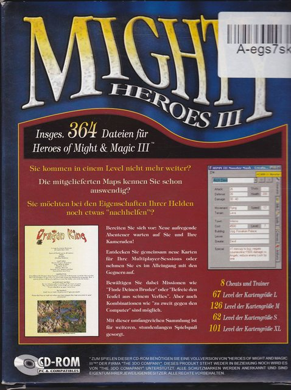
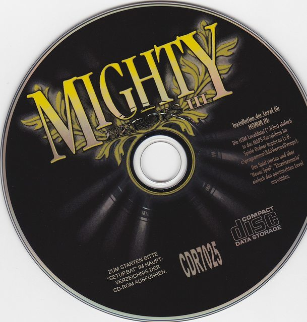

# Mighty Heroes III
Mighty Heroes III is a map pack selled in germany. It contains over 350 maps.

The quality of the maps varies greatly. Some are in english, others in german.

The package was created by _cdv Software Entertainment_. The company went bankrupt in 2010.

Text on back cover:
- "A total of 364 data's (including maps) for Heroes of Might and Magic 3"
- "You are stuck in a level?"
- "Do you already memorized all of the H3 maps?"
- "Do you want to lend yourself a hand by changing your heroes stats?"
